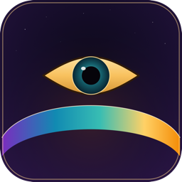

<div align="center">
  

  # Heimdall

  **A lock screen for your Mac that doesn't touch sleep, logout, or the real macOS lock screen.**
</div>

---

Heimdall is a small macOS menu bar / Dock app that throws up a full-screen, authenticated overlay on demand — blocking keyboard, mouse, and trackpad input until you unlock it with Touch ID or your Mac password. It's built for one specific situation: **you want to leave your Mac powered on and fully awake (SSH sessions, long-running jobs, downloads) but you don't want someone who walks up to it to be able to touch anything.**

The built-in macOS lock screen doesn't cleanly solve this if your machine is also going to sleep on its own — sleeping suspends the network and can drop SSH sessions. Heimdall never sleeps the machine, never logs you out, and never invokes `loginwindow`. It's just a very persistent, very hard-to-dismiss window sitting on top of everything else. It also only uses your Mac credentials.

Fun fact / name inspiration, I suppose: Named after Heimdallr. He was the Norse guardian of the Bifröst which was a burning rainbow bridge to Asgard. Heimdallr was able to see for hundreds of miles and never slept.

## Why not just use the normal lock screen?

You can, and for most people you should — this is a narrow tool for a narrow problem. Heimdall exists specifically for the case where:

- You have SSH sessions, `tmux`/`screen` sessions, downloads, or long jobs running that you don't want interrupted.
- Your Mac is configured to sleep after a period of inactivity (which drops network connections), and you don't want to change that system-wide.
- You still want a real, physical-access deterrent for anyone walking up to the machine while it's unattended.

Heimdall holds a power assertion for as long as it's running, so the Mac won't idle-sleep at all while it's active. 

## Features

- **Full-screen lock overlay** on every connected display, above the Dock and menu bar, that captures all input.
- **Touch ID with password fallback**, via Apple's own `LocalAuthentication` — Heimdall never sees or stores your password itself.
- **Never sleeps, never logs out.** An IOKit power assertion keeps the system awake for the app's entire lifetime; the real lock screen and session are never touched. -> BE CAREFUL WITH BATTERY BECAUSE NOBODY EXCEPT YOU CAN ENSURE THAT YOUR COMP DOESN'T DIE
- **Layered hardening** while locked:
  - Cmd+Tab, Force Quit, session termination (Shut Down/Restart/Log Out), and Cmd+H are disabled via AppKit's kiosk-mode presentation options.
  - A supplementary global event tap (optional, permission-gated) additionally swallows Spotlight, Mission Control, and app-switching shortcuts before they ever reach the OS.
  - **Quitting Heimdall itself always requires authentication** — Cmd+Q, the Force Quit dialog, AppleScript `quit`, all of it, no matter how it's triggered.
- **Auto-restart if killed.** An optional LaunchAgent respawns Heimdall if it's ever force-quit while locked, and it comes back locked — never showing an unlocked desktop in between.
- Menu bar item and a permanent Dock icon, both of which trigger the lock screen.

## What it can't protect against

Being upfront about this matters for a tool like this:

- **Holding the power button** to force a shutdown — this is hardware-level and no app can intercept it. (It also kills the very SSH sessions Heimdall exists to protect, so an attacker gains nothing they couldn't get by just correctly unlocking Heimdall.)
- **Closing the lid.** Clamshell sleep overrides Heimdall's power assertion entirely unless an external display/keyboard/mouse and power are attached.
- **Booting into Recovery Mode, Target Disk Mode, or another account.** These require a physical reboot and, on a FileVault-enabled Mac, the real disk password anyway.

None of these are Heimdall bugs — they're bypasses that either destroy the session you were trying to protect, or require the same real credentials Heimdall already asks for.

## Requirements

- A Mac (Apple Silicon or Intel) with Xcode installed.
- [XcodeGen](https://github.com/yonaskolb/XcodeGen) to generate the `.xcodeproj` (`brew install xcodegen`).
- A free Apple ID is enough — Heimdall doesn't need a paid developer account, just a stable, consistent code-signing identity (see below for why that matters).

Heimdall is not sandboxed and is not distributed through the Mac App Store — it can't be, since blocking system-wide input and holding a power assertion both require capabilities the App Sandbox doesn't allow.

## Building it

```bash
git clone https://github.com/<you>/Heimdall.git
cd Heimdall
xcodegen generate
open Heimdall.xcodeproj
```

OR


YOU CAN ALSO JUST DOWNLOAD THE NOTARIZED, PRE-BUILT APP FILE DIRECTLY @ [Heimdall](https://github.com/SrijDude3416/Heimdall/tree/main/Exports/Heimdall%20v1.0)
- Note that GitHub does not recognize the folder as an app, but when you download the repo to your Mac, the folder `Exports/Heimdall v1.0` will contain an app that you can open as-is.


In Xcode, go to the target's **Signing & Capabilities** tab and pick your own team under **Automatic signing**. Then build and run (⌘R), or archive it and drag the built `Heimdall.app` into `/Applications`.

**Important:** once you've granted Accessibility/Input Monitoring permissions (see below), don't change your signing team or certificate — macOS ties those permission grants to the exact code-signing identity, and switching it will silently revoke them and you'll have to re-approve in System Settings.

## First-run setup

Click the shield icon in the menu bar → **Setup Guide…**. Two permissions are involved, and Heimdall works without either of them, just with less hardening:

| Permission | What it's for | Without it |
|---|---|---|
| **Accessibility** | Lets Heimdall detect the global "lock now" hotkey | Hotkey won't work; the menu bar/Dock triggers still do |
| **Input Monitoring** | Powers the supplementary hardening layer that blocks Spotlight, Mission Control, and app-switching shortcuts while locked | The primary lock overlay and AppKit-level hardening (Cmd+Tab, Force Quit, etc.) still work regardless |

The Setup Guide also has an optional **Install Auto-Restart Helper** button, which writes a `LaunchAgent` to `~/Library/LaunchAgents/` and asks for your explicit confirmation before doing so — Heimdall never installs anything persistent without you clicking through it.

## Using it

- **Lock it**: click the menu bar icon → *Lock Now*, click the Dock icon, or use the global hotkey (**⌃⌥⌘L**, once Input Monitoring is granted).
- **Unlock it**: Touch ID is tried automatically the moment the overlay appears; click **Unlock** to retry or to fall back to your password.
- **Quit it**: menu bar icon → *Quit Heimdall*, or Cmd+Q — either way, you'll be asked to authenticate first.

## How it's built

Pure AppKit + SwiftUI, no third-party dependencies. A few points:

- `LocalAuthentication` (`LAContext`) handles all credential verification — Heimdall never implements its own password check.
- The lock overlay is a borderless `NSWindow` per display, sitting at `.screenSaver` window level (the same level real screensavers use to cover everything, menu bar included).
- The project targets **Swift 5 language mode**, deliberately — Swift 6's strict concurrency checker doesn't understand the C-callback/AppKit code this app is built on (`CGEventTap`, raw `NSWindow` control), even though everything here runs on the main thread.

## Contributing

Issues and PRs welcome, especially around the two open edges: idle-timeout auto-lock and hardware second-factor (YubiKey) support were both deliberately left out of v1 to keep the initial hardening surface small and well-understood.

Footnote:
Special thanks to Claude for helping put together the bones of the project and the README
